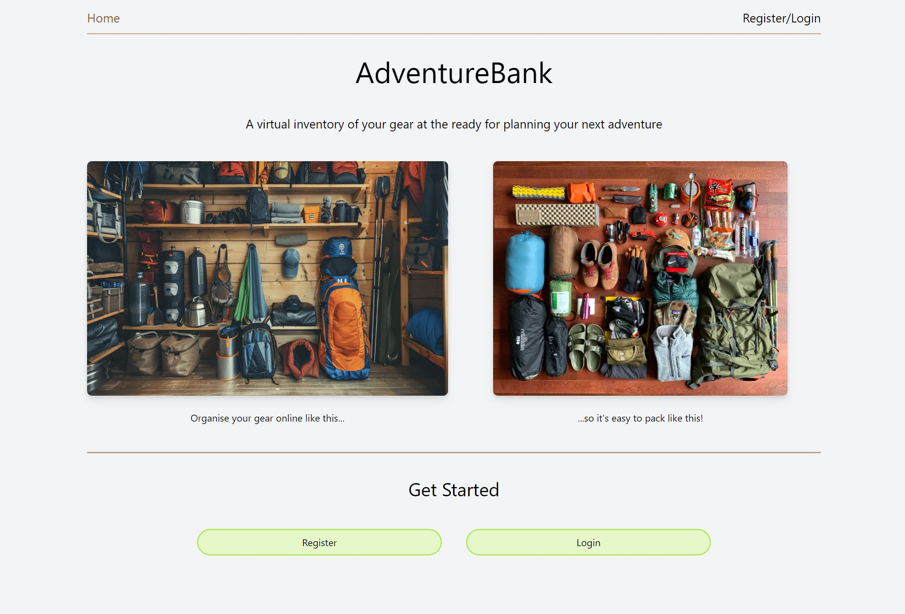
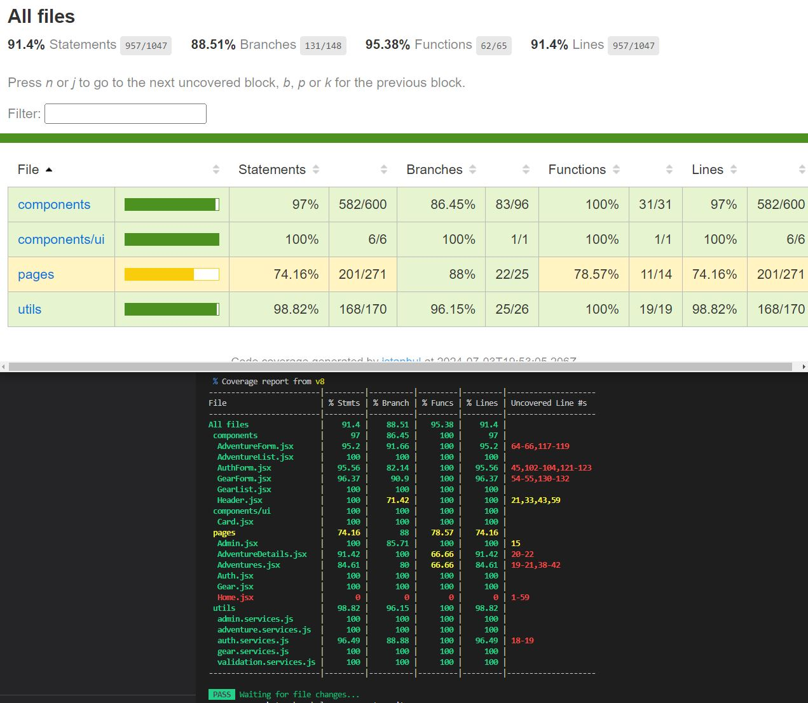
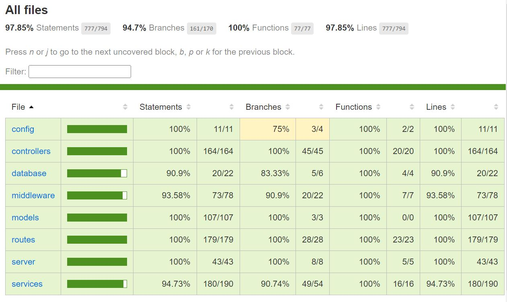

# AdventureBank

The link to the deployed application can be found here:

[[https://adventure-bank.vercel.app/]]

Please note that the server is hosted on a free Render tier and may be slow to load initially.

---
### Summary

This is a full-stack capstone project I developed for my final 2-weeks in the Digital Futures Academy. The assignment was to build an application of our choosing. It was to be produced within an Agile sprint, where we would then run a sprint review and showcase our demo, followed by a retrospective.

AdventureBank is designed to be a Gear Inventory Management and Adventure Planning application that provides a 'sit-and-browse' solution for outdoor adventurers with too much gear. They'd be able to browse their inventory and assign it to a new adventure - allowing them to experiment with different gear kits without having to physically rummage through storage.

---

### My Approach to Development

My overall approach was to adhere to the Agile methodology as much as possible - to create functionally complete and tested components before moving onto the next. I developed up until the feature freeze, where I then went back to double check my features and fix any bugs and to add some finishing CSS styling.

### My order of prioritisation:

1. the **User** and its functionality, including authentication and authorisation on every request through use of jsonwebtoken and middleware. This also included the admin only privileges. 
2. the **Adventure** as this was required to have the gear associated to
3. the **Gear** that could then be added into the adventure
		Feature Freeze
		Bug-fixing and additional styling
		Sprint review and retrospective.
4. Functionality and UI to combine all 3 models
5. Additional features and functionality.

#### Challenges:

- Frontend testing took a lot longer than I had expected to understand properly and make progress with. This was a blocker and cause of delay with development of other user stories.
- I would have benefited from more time planning:
	- on where to store state
	- which components would be reusable and how they would need to be coded.

---

### Future Development

As an outdoor enthusiast myself, I intend to continue working on this project as a passion project and to practice development skills.

- Priority is to complete the main functionality I had in mind, followed up with some UI improvements to accommodate this.
- I'd like to incorporate localStorage in the browser so you don't need to register if you want to simply play around with AdventureBank.
- The homepage would become an overview dashboard for the user, displaying a variety of metrics and perhaps listing 'upcoming adventures'.
- I think it would be useful to add extra fields to Gear - weight, a rating and/or 'favourite' functionality.

I think there's room to add an Ordnance Survey integration to include map grids. I have a vision that a user can add another user into the adventure, to then add another layer of planning depth to the application's potential. This could then naturally lead to incorporating a social aspect.

---

### Tech Stack

| **FrontEnd**    | **BackEnd** |
| --------------- | ----------- |
| React.js        | Node.js     |
| TailwindCSS     | Express     |
| Testing Library | MongoDB     |
|                 | Chai        |
| Vercel          | Render      |

I chose a monolithic architecture for this project as my 3 models (user, adventure, gear) have a tight relationship and so I saw no benefit implementing a microservices approach.

---

### Test Coverage

The homepage is currently static and was not tested.

