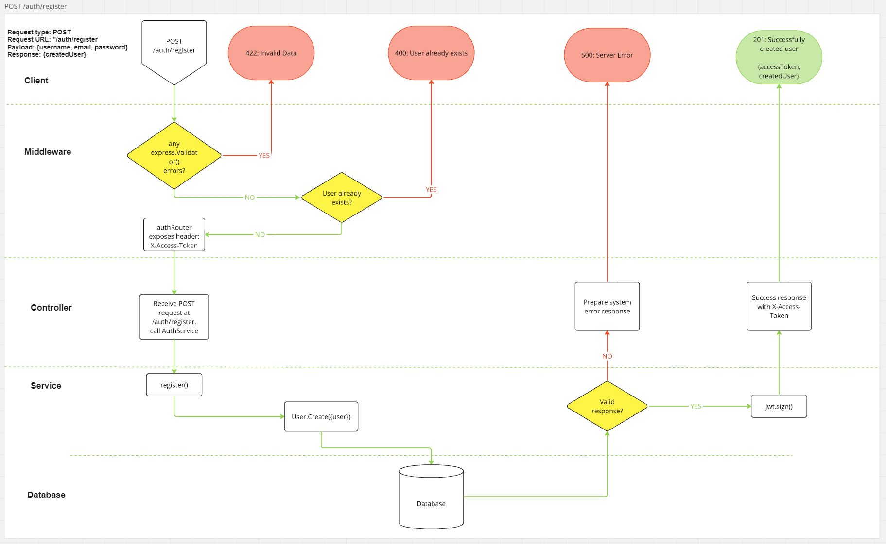
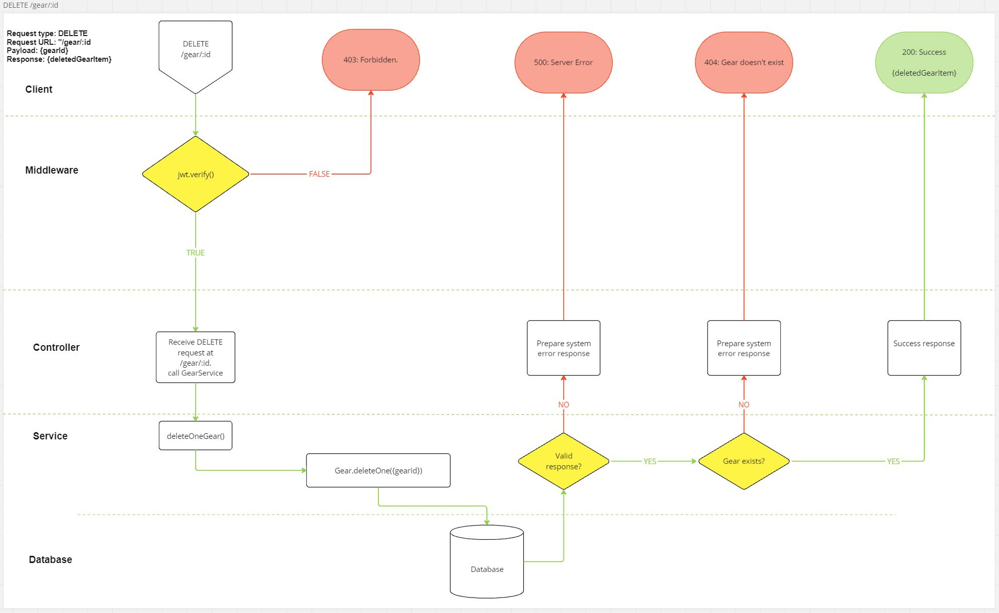

# AdventureBank /TrailMaster / TrailSeeker or something...

#### the WHAT
Gear Inventory Management and Adventure Planning. Construct a packing checklist for your next adventure by creating a new 'adventure' and populate fields with your trusty existing gear. Add new items of gear to your inventory to be used.

---

#### the WHO
Target demographic will be the adventure gear heads who have 7 different pieces of gear suitable for the same task, but they'd explain in great detail to you why they're great at their specific purpose. They likely have a garage or room dedicated to storing gear in meticulously arranged boxes.

#### the WHY
This application will solve the problem of having to physically rummage around trying to piece together the perfect kit setup for their next outdoor adventure. Instead they can create a new 'adventure' online and assign the required gear to it from their database of existing gear. They can review what they have at a glance and refer to the list as a packing list.

#### the HOW

Core Features:

Ideally, anyone can create a list and add some gear (probably default standard values?) but will be required to register and have an account to save and build out their own inventory.

The initial functionality will likely be centered around camping, but should be flexible enough to accommodate a wide range of outdoor pursuits.
Add items of gear into a new adventure list to build a visual list of gear in the form of cards. Each card would have a title, perhaps an image (placeholders for now, user added images could be next iteration), and details of the item such as brand and it's purpose.

Create - new adventure lists, items of individual gear.
Read - get existing lists with associated gear, get individual items of gear that belong to a User.
Update - update the items that are in the adventure list, update the properties of an item of gear.
Delete - lists or items of gear.

Admin permission can view all registered users and delete them.

Possible additional features or optimistic long term improvements to add to documentation:
- Add personal ratings to pieces of gear or comments.
- Include details of the upcoming adventure: date, location, duration, other people involved?
- a map API (Ordnance Survey) integration
- weather api integration
- other users added to your adventure can comment on your gear or planning skills

---

 ### User Interface

 This UI will be built using React.js to render components populated with data received from the backend service API.

---

### Architecture:

This project will be built on Node.js, using the Express.js framework. It will help implement a model-controller-service pattern to create a RESTful API.

---

### [RESTful Routing](#restful-routing)

[/auth](#auth)  
[/user - admin permission only](#user---admin-permission-only)  
[/gear](#gear)  
[/adventure](#adventure)  

---

#### [/auth](#auth)
- POST /auth/register
- POST /auth/login

#### [/admin/user - admin permission only](#user---admin-permission-only)
- GET /admin/user/
<!-- - GET /admin/user/:id -->
- DELETE /admin/user/:id

<!--  -->

#### [/gear](#gear)
- GET /gear
- POST /gear/
- GET /gear/:id
- PUT /gear/:id
- DELETE /gear/:id

#### [/adventure](#adventure)
- GET /adventure
- POST /adventure
- GET /adventure/:id
- PUT /adventure/:id
- DELETE /adventure/:id

---

### Technologies: 
Frontend:
- React.js
- React-Router-Dom
- Axios
- Tailwind
- Testing Library
- Vite
- Vitest
- Coverage v8

Backend:
- Node.js
- Express.js
- express-validator
- Mongoose
- MongoDB
- bcrypt
- jsonWebToken
- dotenv
- Chai
- Mocha
- Sinon
- Supertest
- c8

---

### Deployment
I already have an account with Vercel so will deploy my frontend there.
The backend will be hosted on Render.

### Miro Evidence

